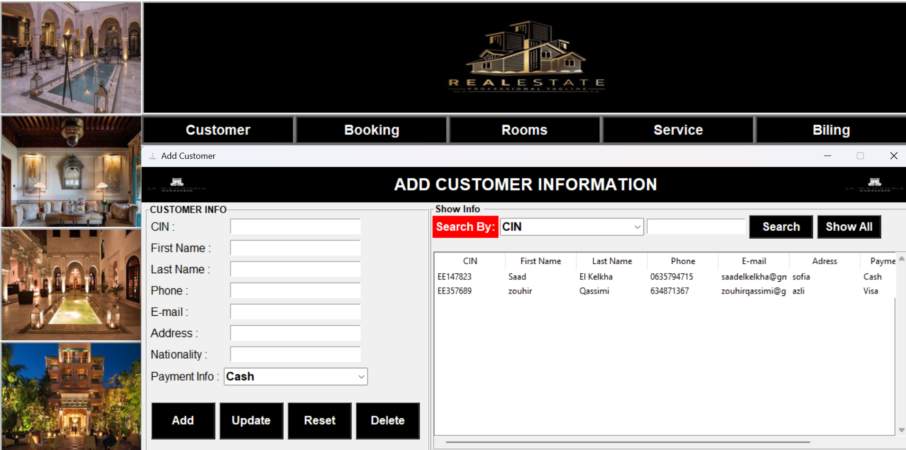
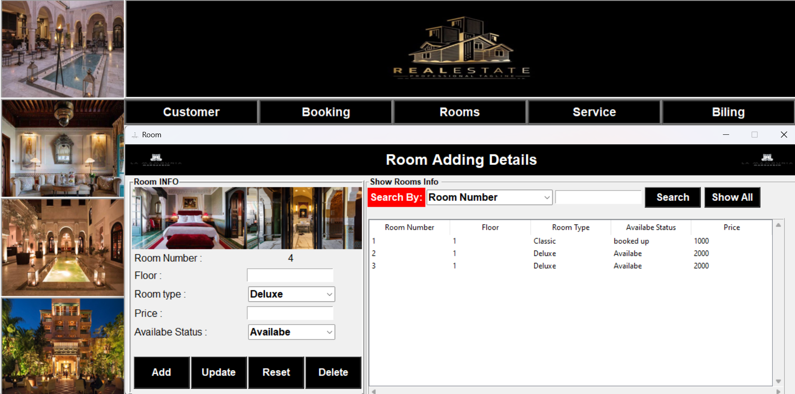
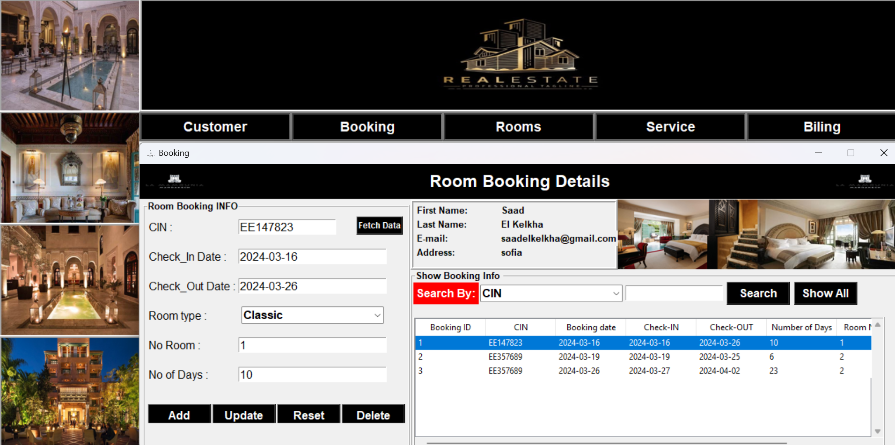
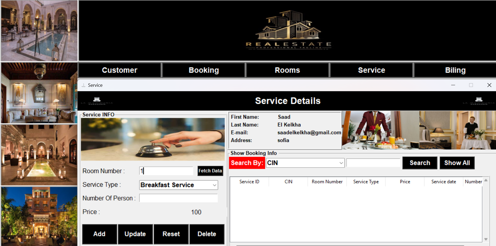
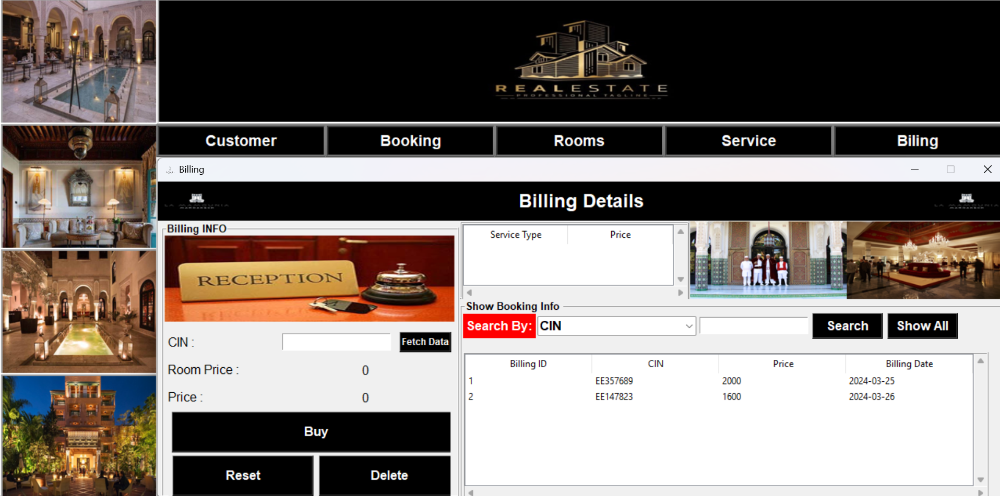

# Hotel-Management
 Python hotel management application with MySQL database includes 5 pages: Customer, Booking, Rooms, Service and Billing. It allows staff to efficiently manage guest 
 details, reservations, room allocation, additional services and billing.

# Main 
 1. Import the necessary modules:
    - `from tkinter import *`: Imports all Tkinter classes and functions for creating GUIs.
    - `from PIL import Image, ImageTk`: Imports the necessary classes from the Pillow library to manipulate images.
    - `from customer import Customer`: Imports the Customer class from the customer.py file.
    - `from room_booking import Booking`: Imports the Booking class from the room_booking.py file.
    - `from room import Room`: Imports the Room class from the room.py file.
    - `from service import Service`: Imports the Service class from the service.py file.
    - `from billing import Billing`: Imports the Billing class from the billing.py file.

 2. Definition of the `Hotel` class:
    - The `__init__` constructor initializes the main application window, defining its title, size and icon.
    - Creates multiple frames to organize UI elements.
    - Loads and displays images in certain frames.
    - Creates buttons for each functionality of the application (Customer, Booking, Rooms, Service, Billing).
    - Defines methods for opening dialog windows when a button is clicked.

 3. Definition of methods for each functionality:
    - `customer_window()`, `booking_window()`, `room_window()`, `service_window()`, `billing_window()`: These methods open a new window (Toplevel) for each 
 functionality by instantiating the corresponding classes (` Customer`, `Booking`, `Room`, `Service`, `Billing`).

 

# Customer
 1. Importing modules:
    - `from tkinter import *`: Imports all Tkinter classes and functions.
    - `from tkinter import ttk`: Imports ttk module from Tkinter for enhanced widgets.
    - `from PIL import Image, ImageTk`: Imports the necessary classes from the Pillow library to manipulate images.
    - `from tkinter import messagebox`: Imports the `messagebox` class from Tkinter to display dialog boxes.
    - `import mysql.connector`: Imports the mysql.connector module for connecting to the MySQL database.

 2. Connection to the MySQL database:
    - Use `mysql.connector.connect()` to establish a connection to the MySQL database.
    - Initializes a cursor to execute SQL queries.

 3. Definition of the `Customer` class:
    - Initializes the main GUI window to add clients.
    - Creates input fields to enter customer information such as first name, last name, CIN, phone number, email, address, nationality and payment method.
    - Uses widgets like `Button`, `Entry`, `Label`, `Combobox`, `Treeview` to display and interact with customer data.
    - Methods in the class handle adding, updating, deleting, displaying and searching customer records in the MySQL database.

 
 
# Rooms
 1. **Importing modules:**
   - `from tkinter import *`: Imports all classes and functions from the Tkinter module for GUI development.
   - `from tkinter import ttk`: Imports the `ttk` module from Tkinter, which provides themed Tkinter widgets.
   - `from PIL import Image, ImageTk`: Imports classes from the Pillow library for image manipulation, enabling the display of images in Tkinter.
   - `from tkinter import messagebox`: Imports the `messagebox` class from Tkinter for displaying message boxes and alerts.
   - `import mysql.connector`: Imports the `mysql.connector` module for connecting to and interacting with MySQL databases.

2. **Connection to the MySQL database:**
   - Establishes a connection to the MySQL database using `mysql.connector.connect()`.
   - Initializes a cursor to execute SQL queries.

3. **Definition of the `Room` class:**
   - Initializes the main GUI window for managing room information.
   - Sets up input fields for adding, updating, and deleting room records, including room number, floor, room type, price, and availability status.
   - Utilizes various Tkinter widgets such as `Label`, `Entry`, `Combobox`, `Button`, `Treeview` for user interaction and data presentation.
   - Provides methods for adding, updating, deleting, displaying, and searching room records in the MySQL database.

# Booking
 1. Importing modules:
    - `from tkinter import *`: Imports all classes and functions from the tkinter library.
    - `from tkinter import ttk`: Imports the ttk module from tkinter for themed widgets.
    - `from PIL import Image, ImageTk`: Imports necessary classes from the Pillow library for image manipulation.
    - `from tkinter import messagebox`: Imports the `messagebox` class from tkinter to display dialog boxes.
    - `import re`: Imports the regular expression module for pattern matching.
    - `from datetime import date`: Imports the `date` class from the datetime module for date-related operations.
    - `import mysql.connector`: Imports the mysql.connector module for interacting with MySQL databases.

2. Connection to the MySQL database:
    - Establishes a connection to the MySQL database using `mysql.connector.connect()`.
    - Initializes a cursor to execute SQL queries.

3. Definition of the `Booking` class:
    - Initializes the main GUI window for handling room bookings.
    - Creates input fields and buttons to input and manage booking details such as check-in/out dates, room type, and customer information.
    - Displays customer details upon entering the Customer Identification Number (CIN).
    - Provides functionality to add, update, delete, display, and search booking records in the MySQL database.
    - Utilizes widgets like `Label`, `Entry`, `Button`, `Combobox`, and `Treeview` for user interaction and data presentation.
    - Validates user input for date format and ensures required fields are filled.
    - Updates room availability status based on bookings.
    - Shows images of room types within the GUI.
    - Handles database operations such as insertion, deletion, update, and retrieval of booking records.

# Service
 1. **Importing modules**:
   - `from tkinter import *`: Imports all Tkinter classes and functions.
   - `from tkinter import ttk`: Imports `ttk` module from Tkinter for enhanced widgets.
   - `from PIL import Image, ImageTk`: Imports necessary classes from the Pillow library to manipulate images.
   - `from tkinter import messagebox`: Imports the `messagebox` class from Tkinter to display dialog boxes.
   - `import re`: Imports the regular expression module.
   - `from datetime import date`: Imports the `date` class from the `datetime` module.
   - `import mysql.connector`: Imports the `mysql.connector` module for connecting to the MySQL database.

2. **Connection to the MySQL database**:
   - Uses `mysql.connector.connect()` to establish a connection to the MySQL database.
   - Initializes a cursor to execute SQL queries.

3. **Definition of the `Service` class**:
   - Initializes the main GUI window for managing hotel services.
   - Creates input fields and widgets to interact with service information such as service type, room number, number of persons, etc.
   - Methods in the class handle functionalities like adding, updating, deleting, displaying, and searching service records in the MySQL database.
   - Utilizes `Treeview` widget to display service records in a tabular format.
   - Provides functionality to fetch customer details based on room number.
   - Allows users to update service price dynamically based on service type selection.
     

# Billing 
 1. **Importing modules:**
   - `from tkinter import *`: Imports all Tkinter classes and functions.
   - `from tkinter import ttk`: Imports the ttk module from Tkinter for enhanced widgets.
   - `from PIL import Image, ImageTk`: Imports the necessary classes from the Pillow library to manipulate images.
   - `from tkinter import messagebox`: Imports the `messagebox` class from Tkinter to display dialog boxes.
   - `import mysql.connector`: Imports the mysql.connector module for connecting to the MySQL database.

2. **Connection to the MySQL database:**
   - Establishes a connection to the MySQL database using `mysql.connector.connect()`.
   - Initializes a cursor to execute SQL queries.

3. **Definition of the `Billing` class:**
   - Initializes the main GUI window for billing.
   - Creates input fields and buttons to handle billing details such as CIN, room price, total price, etc.
   - Displays billing information using widgets like `Label`, `Entry`, `Button`, `Combobox`, `Treeview`.
   - Methods in the class handle fetching services, adding records, viewing records, deleting records, searching records, and resetting fields in the MySQL database.

